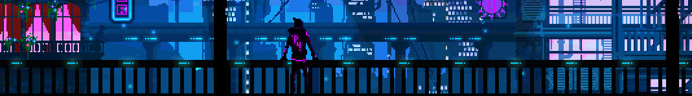

  <h2> <strong> Actively Learning (Strong Suits)</strong></h2>
  

    
  

  <h2> <strong> Trying to Learn </strong></h2>
  

Education🎓: Computer Science with Specialization in Machine Learning (3rd Year)
 
Interested in:🔎 Data Sciences & Machine Learning
 
Learning 👨‍💻: Front End Development (Frustrated)
 
Main Languages 📝: Java, C#, Python
 

 
  
<h2>📘 My Projects</h2>

  
  

    (Coming Soon)™️
  

 
  
<h2>⭐ Achievements</h2>

  
  

    (Coming Soon)™️
  

